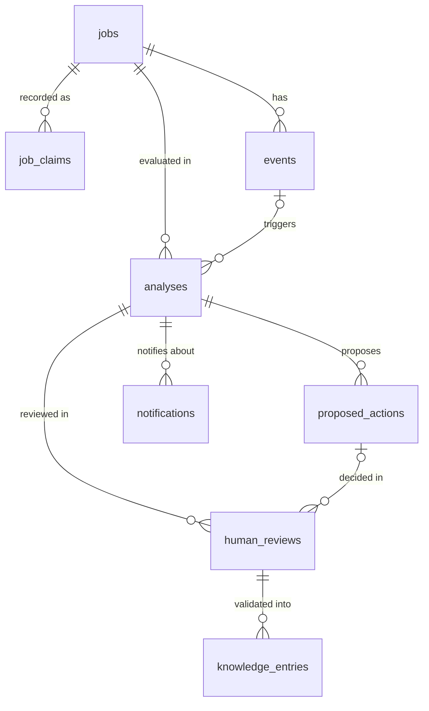

# Domain model: M02 proposal

Status: a proposal for review in M02. It is not a schema, and no migrations
exist.

## Evaluation of the candidate concepts

| Concept | Proposal | Reason |
|---|---|---|
| jobs | Table, in M02 | Holds the identity of each work order. |
| job_claims | Table, in M02 | The supplied jobs have different fields: only W-3 has `device_state`, and only W-1 has `part_receipt`. One row per recorded field keeps sparse data honest, gives each claim its own provenance and gives evidence a precise target. |
| events | Table, in M02 | An append-only log. The ingestion interface writes here. |
| evidence | Not a table: references inside `analyses` | Evidence is a relationship (this event supports or conflicts with that claim), not separate data. A table would add joins without adding facts. Promote it to a table if Show Me Why queries need one. |
| analyses | Table, in M02 | One evaluation of a job, never changed after creation. Deterministic output and AI output are stored in separate sections. |
| findings | Inside `analyses`, in M02 | Findings are always read together with their analysis. Promote them to a table if reviews or queries across jobs need row-level access. |
| proposed_actions | Table, added with the approval flow | Proposed actions have their own lifecycle, and the approval boundary (RULE 1, RULE 3) is enforced on them. |
| human_reviews | Table, added with the approval flow | Append-only decisions on a finding or a proposed action. |
| resolutions | Columns on `human_reviews` | A resolution is recorded as part of a review: a reason plus the actual resolution. |
| knowledge_entries | Table, later | Created only from a validated review. Defer until that feature is built. |
| notifications | Table, later | An outbox of delivery attempts. Defer until notifications are built. |

Result: 4 tables in M02, 2 more with the approval flow and 2 later, for a total
of 8 tables instead of 11. The supplied rules get no table: they are enforced in
engine code, versioned with the engine, and cited by `rule_id`.

## Relationships

Every review belongs to an analysis. A review that decides on a proposed action
also references that action.

## Indicative attributes

The attributes below indicate what each table holds. They are not DDL. Names and
types are settled in M02.

Every table has `id`, `provenance` (a DataProvenance value) and `created_at`.
Every `GENERATED` record also has `producer`, for example
`deterministic-engine@<version>` or `ai:<model-id>`.

- **jobs:** `job_ref` (for example "W-1"), `source` (C02, synthetic or the
  name of an integration).
- **job_claims:** `job_id`, `field` (for example "stage"), `value` (the text as
  recorded), `recorded_at` (nullable), `effective_from` (nullable: when the
  state began, if known; time in stage needs it), `superseded_by` (nullable),
  `source_event_id` (nullable).
- **events:** `event_ref` (for example "R-1"), `job_id`, `event_type` (the
  label as supplied, for example "part scan"), `occurred_at_raw` (the text as
  supplied, for example "08:40"), `occurred_at` (a nullable timestamp, set only
  when a full timestamp is known), `producer` (fixture loader, manual entry,
  integration, simulator or approved action), `payload`, `ingested_at`,
  `proposed_action_id` and `review_id` (both nullable, set for approved
  actions).
- **analyses:** `job_id`, `trigger_event_id` (nullable), `engine_version`,
  `input_refs` (the claims, events and rules considered).
  - A `deterministic` section holds the classification of each claim, evidence
    references with their stance, missing information, the known owner, timing
    (or "unavailable"), priority factors and findings. Each finding has its
    diagnosis, its evidence references and its producer.
  - A `generated` section (nullable) holds the explanation, investigation
    guidance and model ID.
  - `depends_on_synthetic` (boolean).
  - The current analysis for a job is its most recent one.
- **proposed_actions:** `analysis_id`, `job_id`, `kind` (for example
  `task_recommendation` or `status_update`), `owner_role`, `source_refs`,
  `proposed_change` (for status updates: the field and its from and to values),
  `producer`, `status` (proposed, approved, corrected, executed or failed),
  `executed_at`.
- **human_reviews:** `analysis_id`, `proposed_action_id` (nullable),
  `finding_ref` (nullable), `decision` (APPROVE or CORRECT), `reason`,
  `actual_resolution` (nullable), `reviewer` (the authenticated user and their
  role). Provenance is `HUMAN_VALIDATED`. The reviewer identity is recorded for
  accountability only and is never used for scoring.
- **knowledge_entries (later):** `source_review_id`, `scope` (the situation the
  entry applies to), `statement`, `validated_by`, `validated_at`, `status`
  (active or retired). An entry never modifies engine rules. It is used as
  retrieval context for the AI layer and is always shown with its source.
- **notifications (later):** `analysis_id`, `channel` (for example Telegram),
  `recipient_role`, `reason`, `delivery_status` (pending, sent or failed, taken
  from the actual delivery result), `attempted_at`.

## Invariants the schema should enforce

- Events, analyses and human reviews are append-only. A claim is replaced by a
  newer claim, never updated in place.
- `provenance` is required and never changes.
- `SUPPLIED` rows come only from the fixture loader, `INTEGRATION` rows only
  from authenticated integration adapters, and `HUMAN_VALIDATED` rows only from
  the human review flow.
- A task recommendation requires an `owner_role` and at least one entry in
  `source_refs` (RULE 1).
- A status update runs only when an APPROVE review by an authorized reviewer
  references that exact proposed action (RULE 3). It runs on the server and
  writes a new event and claim through the ingestion interface.
- No table or column stores performance metrics for individual people
  (RULE 2). Owner fields hold roles.
- `occurred_at` and `effective_from` stay null unless a real timestamp, or a
  clearly `SYNTHETIC` one, exists. Time in stage is calculated only when
  `effective_from` and the current time are both known.

## Loading C02 into this model

Loading the fixture produces:

- 4 jobs
- 14 claims: 4 each for W-1 and W-2, and 3 each for W-3 and W-4
- 2 events

Every row is `SUPPLIED`. Every `occurred_at` and `effective_from` is null. The
`occurred_at_raw` values are "08:40" and "08:50".

## Decisions for M02 review

1. Should claims be stored as rows (proposed) or as fixed columns on `jobs`?
2. Should findings and evidence stay inside `analyses` (proposed) or get their
   own tables?
3. Is a reject or dismiss decision needed in addition to APPROVE and CORRECT?
4. What provenance does an approved status change get? The proposal is
   `HUMAN_VALIDATED`, linked to its review.
Settled in M01.5:

- The stack is Next.js, TypeScript, Tailwind CSS, Supabase and Vitest.
- The contract values live in `src/domain/contracts.ts`.
- `INTEGRATION` was added as a fifth provenance value, for data from real
  external systems.
